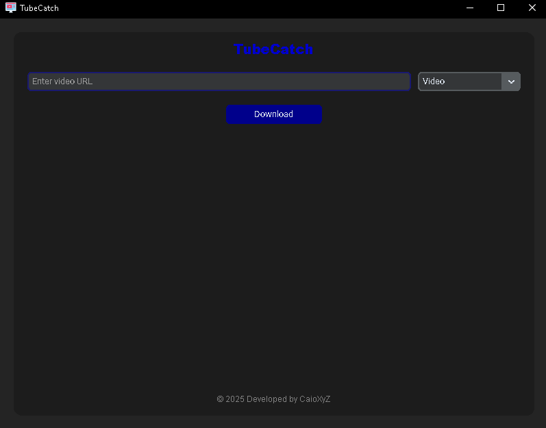

<h1 align=center>TubeCatch</h1>

<p align="center">
  
  
  
</p>

<p align=center>TubeCatch is an open-source YouTube video and audio downloader with a graphical user interface (GUI) built using `customtkinter`. It allows users to download videos in MP4 format or extract audio in MP3 format easily.</p>

## Screenshot

<p align="center">
  
</p>

## Features
- Download YouTube videos in MP4 format
- Extract audio from YouTube videos in MP3 format
- Simple and intuitive GUI
- Download history tracking

## Installation

### Requirements
Make sure you have the following dependencies installed:
- Python 3.8+
- `customtkinter`
- `pytubefix`

### Steps
1. Clone this repository:
   ```bash
   git clone https://github.com/caioreis29974/TubeCatch.git
   cd TubeCatch
   ```
2. Install dependencies:
   ```bash
   pip install -r requirements.txt
   ```
3. Run the application:
   ```bash
   python main.py
   ```

## Usage
1. Open TubeCatch.
2. Enter the YouTube video URL.
3. Choose whether to download the video (MP4) or audio (MP3).
4. Click the "Download" button.
5. Select a directory to save the file.
6. Wait for the download to complete.

## License
This project is licensed under the MIT License - see the [LICENSE](LICENSE) file for details.

## Contribution
Contributions are welcome! Feel free to open an issue or submit a pull request.
